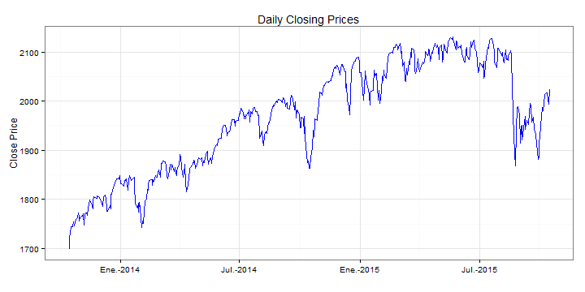
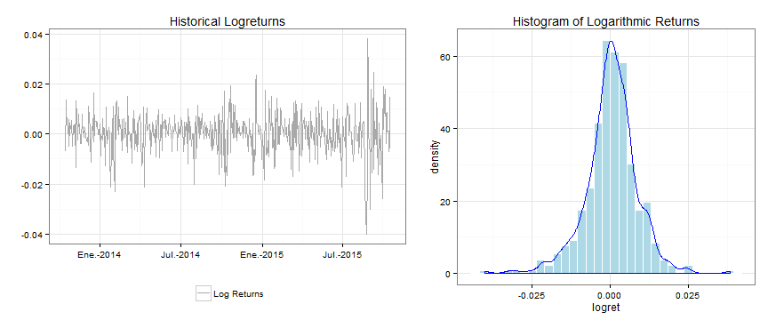
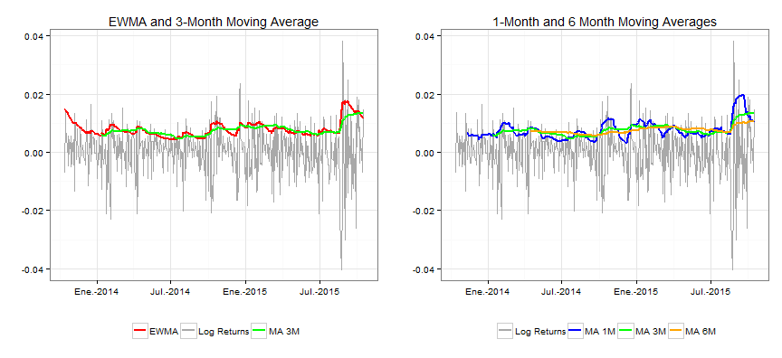

--- 
title       : Historical Volatility Analysis of The SP500 Index
subtitle    : Different Estimation Methods
author      : Antonio Rene Hernandez
job         : 
framework   : io2012        # {io2012, html5slides, shower, dzslides, ...}
highlighter : highlight.js  # {highlight.js, prettify, highlight}
hitheme     : tomorrow      # 
widgets     : []            # {mathjax, quiz, bootstrap}
mode        : selfcontained # {standalone, draft}
knit        : slidify::knit2slides

--- 

## Variation of Prices of Financial Assets

* Financial asset prices are stochastic processes 
* Most price stochastic models are based on modeling price variation
* An important model component on measuring price variation is volatility.
* To see some volatility estimation measures, close price data from the SP500 index in a span of two years will be used.
* This data can be downloaded [here](http://real-chart.finance.yahoo.com/table.csv?s=%5EGSPC&d=9&e=15&f=2015&g=d&a=9&b=14&c=2013&ignore=.csv)

--- 
## Price behaviour

* Price behaviour is modeled as geometric brownian motion (GBM), which graphically looks lag a jigsaw path with some trend.
* In modeling GBM, the logartithmic returns (logreturns), calculated as the difference between the logatithm of price at one time and the previous, are an esential part of them

---  

## Logarithmic returns 

* When graphing logreturns, it can be seen that it follows an apparent stationary process in certain lapses of time.  The distribution of this logreturns approximates to a normal distribution.

---  

## Volatility and its Estimation

* Volatility is the standard deviation of this distribution.
* Volatility varies through time.  Some simple measures are obtained through smoothing, being exponential weighted average and moving averages. Differences between this measures can be observed in the following graphs.

 

